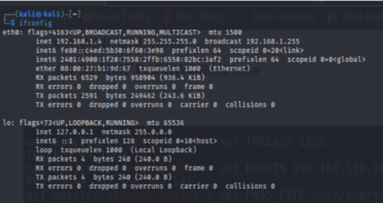
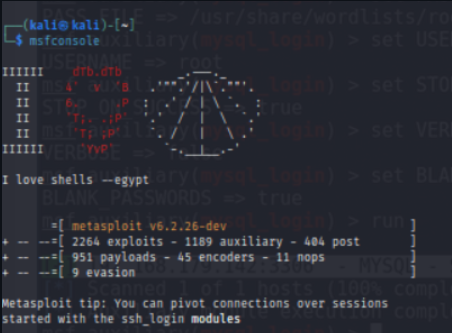
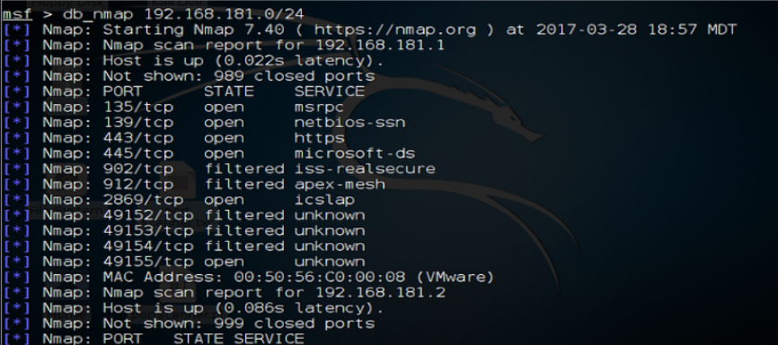
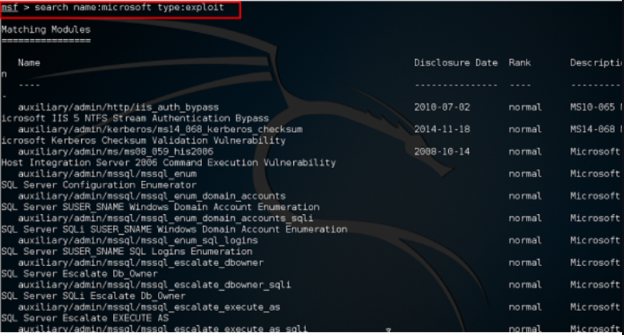
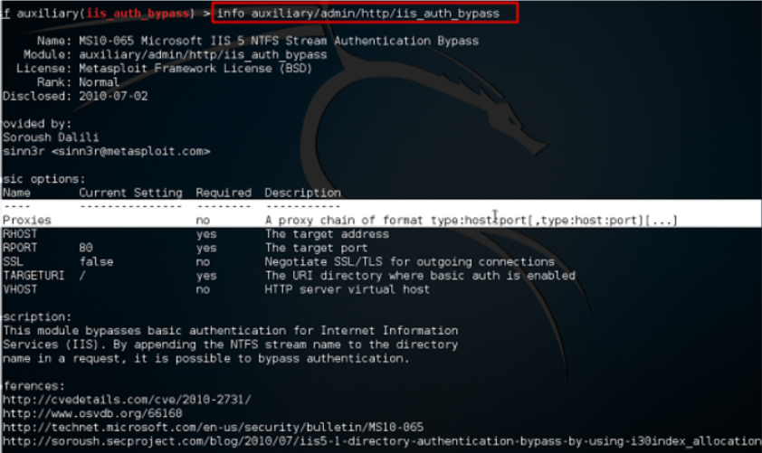
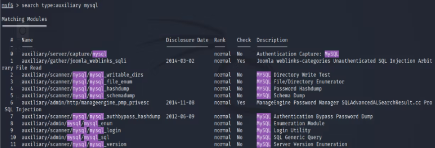
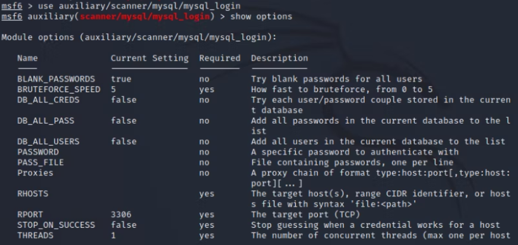

# Metasploit-for-reconnaissance
# Metasploit
Metasploit for reconnaissance in pentesting

# AIM:

To get introduced to Metasploit Framework and to  perform reconnaissance  in pentesting .

## DESIGN STEPS:

### Step 1:

Install kali linux either in partition or virtual box or in live mode

### Step 2:

Investigate on the various categories of tools as follows:

### Step 3:

Open terminal and try execute some kali linux commands

## EXECUTION STEPS AND ITS OUTPUT:
## PROGRAM:
Find out the ip address of the attackers system

## OUTPUT:

## Invoke msfconsole:

## OUTPUT:

Type help or a question mark "?" to see the list of all available commands you can use inside msfconsole.

## OUTPUT:

## Port Scanning:
Following command is executed for scanning the systems on our local area network with a TCP scan (-sT) looking for open ports between 1 and 1000 (-p1-1000). msf > nmap -sT 192.168.1810/24 -p1-1000

## OUTPUT:

## step4:
use the db-nmap command to scan and save the results into Metasploit's postgresql attached database. In that way, you can use those results in the exploitation stage later.

scan the targets with the command db_nmap as follows. msf > db_nmap 192.168.181.0/24

## OUTPUT:

Metasploit has a multitude of scanning modules built in. If we open another terminal, we can navigate to Metasploit's auxiliary modules and list all the scanner modules. cd /usr/share /metasploit-framework/modules/auxiliary kali > ls -l

## OUTPUT:

Search is a powerful command in Metasploit that you can use to find what you want to locate. msf >search name:Microsoft type:exploit

## OUTPUT:

The info command provides information regarding a module or platform.
## OUTPUT:

Before beginning, set up the Metasploit database by starting the PostgreSQL server and initialize msfconsole database as follows: systemctl start postgresql msfdb init

## MYSQL ENUMERATION
Find the IP address of the Metasploitable machine first. Then, use the db_nmap command in msfconsole with Nmap flags to scan the MySQL database at 3306 port. db_nmap -sV -sC -p 3306 <metasploitable_ip_address>

## OUTPUT:

Use the search option to look for an auxiliary module to scan and enumerate the MySQL database. search type:auxiliary mysql

## OUTPUT:

use the auxiliary/scanner/mysql/mysql_version module by typing the module name or associated number to scan MySQL version details. use 11 Or: use auxiliary/scanner/mysql/mysql_version

## OUTPUT:

Use the set rhosts command to set the parameter and run the module, as follows:

## OUTPUT:

After scanning, you can also brute force MySQL root account via Metasploit's auxiliary(scanner/mysql/mysql_login) module.

## OUTPUT:

set the PASS_FILE parameter to the wordlist path available inside /usr/share/wordlists: set PASS_FILE /usr/share/wordlistss/rockyou.txt Then, specify the IP address of the target machine with the RHOSTS command. set RHOSTS Set BLANK_PASSWORDS to true in case there is no password set for the root account. set BLANK_PASSWORDS true

## OUTPUT:

## RESULT:
The Metasploit framework for reconnaissance is  examined successfully
